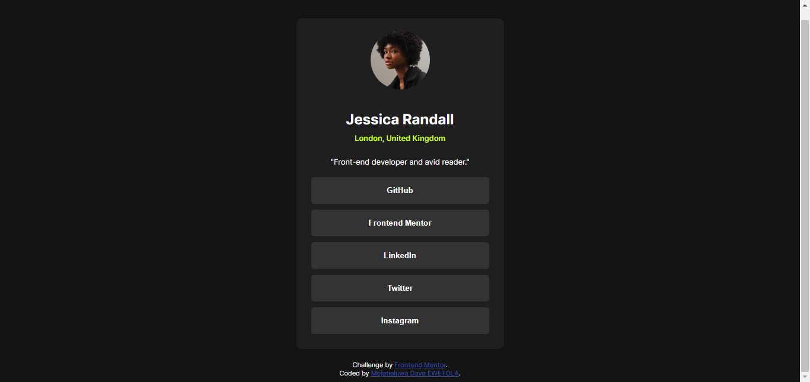

# Frontend Mentor - Social links profile solution

This is a solution to the [Social links profile challenge on Frontend Mentor](https://www.frontendmentor.io/challenges/social-links-profile-UG32l9m6dQ). Frontend Mentor challenges help you improve your coding skills by building realistic projects. 

## Table of contents

- [Overview](#overview)
  - [The challenge](#the-challenge)
  - [Screenshot](#screenshot)
  - [Links](#links)
- [My process](#my-process)
  - [Built with](#built-with)
  - [What I learned](#what-i-learned)
  - [Continued development](#continued-development)
  - [Useful resources](#useful-resources)
- [Author](#author)
- [Acknowledgments](#acknowledgments)

## Overview

### The challenge

Users should be able to:

- See hover and focus states for all interactive elements on the page

### Screenshot

### Links

- Solution URL: [Solution](https://github.com/Mojetioluwa/social-links-profile-main)
- Live Site URL: [Live URL](https://your-live-site-url.com)

## My process

### Built with

- Semantic HTML5 markup: I've learned the importance of using semantic elements in HTML. It not only makes the code easier to read and maintain, but also improves accessibility.
- CSS custom properties: I've discovered the power of CSS custom properties, which allowed me to create more flexible and maintainable styles.
- Flexbox: This project helped me to understand and master CSS Flexbox. It's a powerful tool for creating responsive layouts.
- Mobile-first workflow: I've adopted a mobile-first approach in this project. It's a design strategy that starts with designing for smaller screens first and then enhancing the experience for larger screens.

### What I learned

This project was a great learning experience for me. I've learned how to structure my HTML in a semantic way, how to create flexible and maintainable styles with CSS custom properties, and how to create responsive layouts with Flexbox. I've also adopted a mobile-first workflow, which I found to be a very effective design strategy.

### Continued development

I plan to continue improving my CSS skills, especially in areas like Grid and animations.

### Useful resources

- [FlexboxFroggy](https://flexboxfroggy.com/) - This helped me to understand and master CSS Flexbox.
- [W3Schools](https://www.w3schools.com) - This is also useful for practice.

## Author

<!-- - Website - [Add your name here](https://www.your-site.com) -->
- Frontend Mentor - [@MOjetioluwa](https://www.frontendmentor.io/profile/Mojetioluwa)
- Twitter - [@mojetioluwaDE](https://www.twitter.com/mojetioluwaDE)

## Acknowledgments

This is where you can give a hat tip to anyone who helped you out on this project. Perhaps you worked in a team or got some inspiration from someone else's solution. This is the perfect place to give them some credit.
